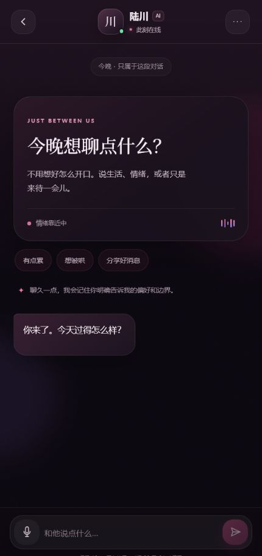
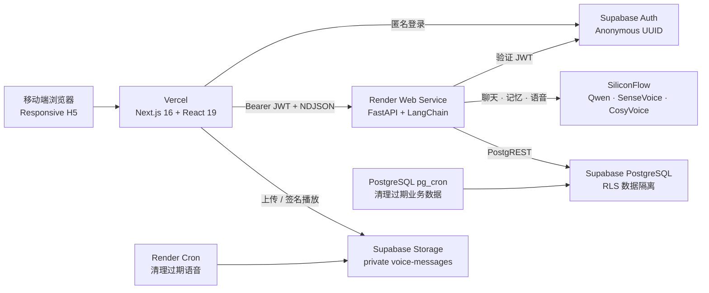
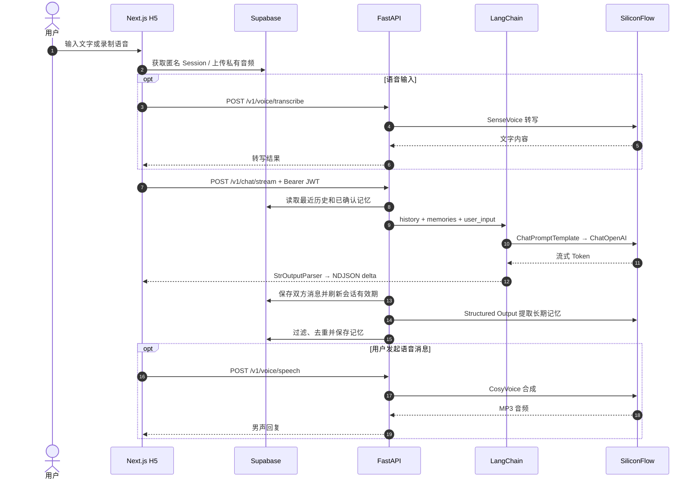
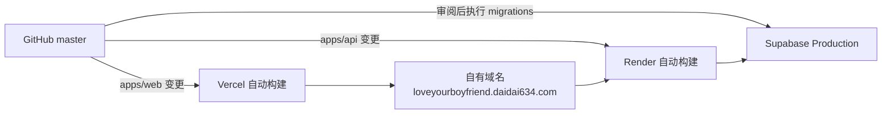

<div align="center">

# Love Your Boyfriend

### 一个懂得接住情绪，也记得住细节的沉浸式 AI 陪伴 H5

移动端优先 · 匿名即用 · 流式对话 · 长期记忆 · 语音收发

[在线体验](https://loveyourboyfriend.daidai634.com/) · [API 状态](https://loveyourboyfriend.onrender.com/health) · [部署说明](docs/deployment.md)

</div>

> [!IMPORTANT]
> “陆川”是面向成年用户的虚构 AI 聊天伙伴，不是真人，也不替代现实关系、心理咨询或紧急援助。

## 产品预览

<p align="center">
  <a href="https://loveyourboyfriend.daidai634.com/">
    
  </a>
</p>

这是一个为移动端场景设计的沉浸式虚拟陪伴应用。用户无需注册账号或设置密码，打开页面即可获得 Supabase 匿名 UUID，并在同一客户端持续恢复历史会话、明确偏好和关系边界。

角色“陆川”的表达目标是年轻、有活力而性格成熟：回复保持短句和口语感，先接住具体细节，再自然推进对话；避免机械复述、客服腔、说教和情感操控。

## MVP 核心能力

| 能力           | 当前实现                                                                 |
| -------------- | ------------------------------------------------------------------------ |
| 沉浸式移动体验 | 响应式深色 H5、情绪化动效、快捷开场、流式消息气泡                        |
| 匿名身份       | Supabase Anonymous Sign-Ins；客户端自动创建并恢复匿名 Session            |
| 智能对话       | LangChain 调用 SiliconFlow 的 `Qwen/Qwen3.5-35B-A3B`，以 NDJSON 增量返回 |
| 长期记忆       | Structured Output 提取用户明确表达的身份、偏好、关系、日程和边界         |
| 历史恢复       | PostgreSQL 保存会话和消息；再次打开时恢复最近一次对话                    |
| 语音收发       | 浏览器录音 → SenseVoice 转写 → 对话链 → CosyVoice 男声合成               |
| 私有语音       | 原始语音和合成音频写入 Supabase 私有 Storage，通过短期签名 URL 播放      |
| 容错回复       | 模型供应商不可用且尚未产生内容时，使用上下文感知的本地回复保持会话连续   |
| 数据保留       | 聊天、记忆和匿名资料保留 90 天；活跃会话会刷新到期时间                   |

## 系统架构



前后端使用同一个 GitHub 仓库和 `master` 生产分支：Vercel 只监听 `apps/web`，Render 以 `apps/api` 为根目录部署 API。Supabase 独立提供身份、数据库和对象存储。

## 一次对话如何流动



## LangChain 在项目中的职责

项目没有引入 LangGraph。当前工作流是一条明确、可测试的 LangChain Runnable：

```text
ChatPromptTemplate
  ├─ 陆川角色、安全与关系边界
  ├─ 最近 7 条对话历史
  ├─ 用户明确确认的长期记忆
  └─ 当前用户输入
        ↓
ChatOpenAI（SiliconFlow OpenAI-compatible API）
        ↓
StrOutputParser
        ↓
NDJSON 流式事件 → Web 消息气泡
```

| 模块                                         | 作用                                                                            |
| -------------------------------------------- | ------------------------------------------------------------------------------- |
| [`prompts.py`](apps/api/app/ai/prompts.py)   | “陆川”角色、自然口语规则、关系边界、安全规则和记忆提取提示词                    |
| [`chains.py`](apps/api/app/ai/chains.py)     | 构建聊天模型、记忆模型和 `ChatPromptTemplate → ChatOpenAI → StrOutputParser` 链 |
| [`memory.py`](apps/api/app/ai/memory.py)     | 使用 Pydantic Structured Output 提取、过滤并去重长期记忆                        |
| [`chat.py`](apps/api/app/services/chat.py)   | 编排历史、记忆、模型流、消息持久化、错误诊断和上下文兜底                        |
| [`fallback.py`](apps/api/app/ai/fallback.py) | 在供应商异常且未输出 Token 时生成不重复、能承接上下文的本地回复                 |

长期记忆只接收用户明确表达且有持续价值的信息，类别限定为：`identity`、`preference`、`relationship`、`routine`、`boundary`。密码、证件、精确住址、支付信息和健康诊断不会进入记忆提示词的采集范围。

## 仓库结构

```text
loveyourboyfriend/
├─ apps/
│  ├─ web/                         # Next.js 移动端 H5
│  │  └─ src/
│  │     ├─ app/                   # 页面、布局与全局视觉系统
│  │     ├─ components/            # 沉浸式 ChatShell
│  │     ├─ hooks/                 # 匿名会话、聊天状态、语音录制
│  │     └─ lib/                   # API 流读取与 Supabase 客户端
│  └─ api/                         # Python 3.12 FastAPI 服务
│     ├─ app/
│     │  ├─ ai/                    # LangChain、Prompt、记忆、兜底
│     │  ├─ routes/                # Chat 与 Voice HTTP API
│     │  ├─ services/              # 对话应用服务
│     │  ├─ repositories/          # Supabase PostgREST 持久化
│     │  └─ jobs/                  # 私有语音清理任务
│     └─ tests/                    # Pytest API 与领域测试
├─ supabase/
│  ├─ migrations/                  # 表、RLS、Storage、pg_cron
│  └─ config.toml                  # Supabase CLI 配置
├─ docs/
│  ├─ assets/                      # GitHub 展示资源
│  ├─ deployment.md                # 平台部署说明
│  └─ superpowers/                 # 产品规格和实施计划
├─ render.yaml                     # Render API + Cron Blueprint
├─ pnpm-workspace.yaml             # Monorepo 工作区
└─ package.json                    # 根目录开发、测试和构建命令
```

## 技术栈

| 层     | 技术                                                               |
| ------ | ------------------------------------------------------------------ |
| Web    | Next.js 16、React 19、TypeScript 6、Tailwind CSS 4                 |
| API    | Python 3.12、FastAPI、Uvicorn、Pydantic 2、HTTPX                   |
| AI     | LangChain 1.x、langchain-openai、SiliconFlow OpenAI-compatible API |
| Models | `Qwen/Qwen3.5-35B-A3B`、`Qwen/Qwen3.5-9B`、SenseVoice、CosyVoice   |
| Data   | Supabase Auth、PostgreSQL、PostgREST、Storage、RLS、pg_cron        |
| Test   | Vitest、Testing Library、Pytest、Ruff、ESLint、TypeScript          |
| Deploy | GitHub、Vercel、Render、Supabase                                   |

## 本地开发

### 环境要求

- Node.js 20.9+
- pnpm 11
- Python 3.12
- [uv](https://docs.astral.sh/uv/)
- 一个已开启 Anonymous Sign-Ins 的 Supabase 项目
- 一个 SiliconFlow API Key

### 1. 安装依赖

```powershell
git clone https://github.com/335691851/loveyourboyfriend.git
Set-Location loveyourboyfriend

pnpm install
uv sync --project apps/api
```

### 2. 准备环境变量

```powershell
Copy-Item apps/web/.env.example apps/web/.env.local
Copy-Item apps/api/.env.example apps/api/.env
```

前端公开配置：

| 变量                                   | 说明                                                |
| -------------------------------------- | --------------------------------------------------- |
| `NEXT_PUBLIC_SUPABASE_URL`             | Supabase Project URL                                |
| `NEXT_PUBLIC_SUPABASE_PUBLISHABLE_KEY` | 浏览器可用的 Publishable Key                        |
| `NEXT_PUBLIC_API_BASE_URL`             | 本地为 `http://localhost:8000`，生产填写 Render URL |

API 服务端配置：

| 变量                            | 说明                                         |
| ------------------------------- | -------------------------------------------- |
| `OPENAI_API_KEY`                | SiliconFlow API Key，只能保存在服务端        |
| `OPENAI_BASE_URL`               | `https://api.siliconflow.cn/v1`              |
| `CHAT_MODEL`                    | `Qwen/Qwen3.5-35B-A3B`                       |
| `MEMORY_MODEL`                  | `Qwen/Qwen3.5-9B`                            |
| `TRANSCRIPTION_MODEL`           | SenseVoice 模型标识                          |
| `SPEECH_MODEL` / `SPEECH_VOICE` | CosyVoice 模型和音色标识                     |
| `SUPABASE_URL`                  | Supabase Project URL                         |
| `SUPABASE_PUBLISHABLE_KEY`      | 用于携带用户 JWT 访问 PostgREST              |
| `SUPABASE_SECRET_KEY`           | 仅用于服务端清理私有语音                     |
| `DATABASE_URL`                  | PostgreSQL 连接串，用于迁移和运维            |
| `ALLOWED_ORIGINS`               | 允许访问 API 的 Web Origin，多个值用逗号分隔 |
| `DATA_RETENTION_DAYS`           | 数据和语音保留天数，默认 `90`                |

完整模板见 [`apps/web/.env.example`](apps/web/.env.example) 和 [`apps/api/.env.example`](apps/api/.env.example)。不要把 `.env`、API Key 或数据库密码提交到 Git。

### 3. 初始化 Supabase

1. 在 Supabase Authentication 开启 **Anonymous Sign-Ins**。
2. 审阅 [`supabase/migrations/`](supabase/migrations/) 中的 SQL。
3. 使用 Supabase CLI 连接目标项目并应用迁移。
4. 确认 `voice-messages` Bucket 为私有，并且业务表已启用 RLS。

迁移会创建 `profiles`、`conversations`、`messages`、`memories`，为匿名用户配置基于 `auth.uid()` 的访问策略，并安排每日过期数据清理。

### 4. 启动前后端

分别打开两个终端：

```powershell
pnpm dev:web
```

```powershell
pnpm dev:api
```

- Web：<http://localhost:3000>
- API Health：<http://localhost:8000/health>
- API Docs（非生产环境）：<http://localhost:8000/docs>

## API 概览

除 `/health` 外，业务接口都要求 `Authorization: Bearer <Supabase access token>`。

| 方法    | 路径                              | 说明                                                           |
| ------- | --------------------------------- | -------------------------------------------------------------- |
| `GET`   | `/health`                         | 服务状态、部署 revision、供应商主机和实际聊天模型              |
| `POST`  | `/v1/chat/stream`                 | 创建或继续会话，以 NDJSON 返回 `start/delta/message/done` 事件 |
| `GET`   | `/v1/conversations`               | 查询当前匿名用户最近的会话                                     |
| `GET`   | `/v1/conversations/{id}/messages` | 恢复指定会话的历史消息                                         |
| `PATCH` | `/v1/messages/{id}/audio`         | 将私有音频路径关联到消息                                       |
| `POST`  | `/v1/voice/transcribe`            | 上传音频并返回转写文本                                         |
| `POST`  | `/v1/voice/speech`                | 将“陆川”的回复合成为 MP3                                       |

`/v1/chat/stream` 使用 `application/x-ndjson`，而不是一次性 JSON。前端通过 [`consumeNdjson`](apps/web/src/lib/api.ts) 持续读取事件，使首个 Token 到达后立即更新消息气泡。

## 测试与质量检查

```powershell
pnpm test          # Vitest + Pytest
pnpm lint          # ESLint + TypeScript + Ruff
pnpm build         # Next.js 生产构建
pnpm format:check  # Prettier + Ruff format check
```

测试覆盖匿名认证、CORS、Schema 契约、LangChain 请求兼容、单一 System Prompt、流式持久化、记忆去重、上下文兜底、语音路由、清理任务、NDJSON 解析和核心聊天 UI。

## 生产部署



- **Vercel**：Root Directory 为 `apps/web`，部署 Next.js 前端。
- **Render**：Root Directory 为 `apps/api`，部署 FastAPI；健康检查为 `/health`。
- **Render Cron**：每日删除超过保留期的私有语音对象。
- **Supabase**：提供匿名认证、PostgreSQL、私有 Storage 和 `pg_cron`。
- **CI/CD**：Vercel 与 Render 分别监听同一仓库的 `master` 分支并自动发布。

平台参数和环境变量清单见 [部署初始化文档](docs/deployment.md) 与 [`render.yaml`](render.yaml)。

## 数据、隐私与安全

- **匿名而非指纹识别**：使用 Supabase 生成的匿名用户 UUID，不采集 UA 指纹作为身份凭证。
- **按用户隔离**：所有业务表启用 RLS，策略以 `auth.uid()` 限制读写范围。
- **最小记忆**：只保存用户明确表达且对连续交流有价值的长期事实，并在入库前过滤、去重。
- **私有音频**：Storage Bucket 不公开，音频路径必须以当前用户 UUID 开头。
- **90 天保留**：新消息刷新活跃会话有效期；`pg_cron` 清理过期消息、记忆、会话和无活动资料。
- **密钥分层**：浏览器只持有 Publishable Key；Secret Key、模型 API Key 和数据库密码只存在于 Render。
- **关系边界**：角色 Prompt 禁止制造愧疚、嫉妒、占有和依赖，不声称替代现实关系。

## 当前状态

项目处于可部署的 MVP 阶段，已打通移动端 UI、匿名身份、真实模型对话、长期记忆、语音、持久化和生产部署链路。当前采用单角色、单最近会话的产品形态，尚未引入传统账号密码、SSO、多角色市场、付费系统或 LangGraph 工作流。

后续适合继续建设：会话列表和管理、可控记忆面板、语音体验优化、端到端测试、模型质量评测、可观测性与成本统计。

---

<div align="center">

Built with Next.js · FastAPI · LangChain · Supabase · SiliconFlow

</div>
